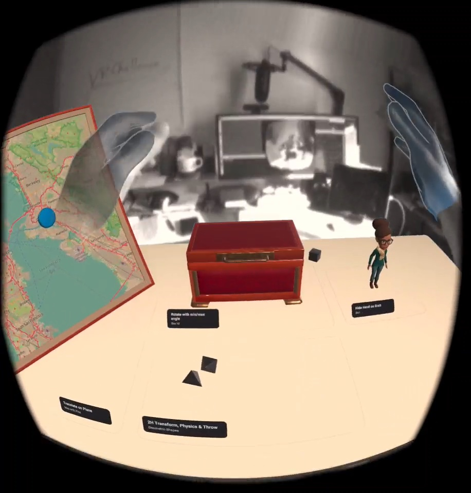

# Unity VR Starter Kit
This is a getting starter package for creating VR experiences for Meta Quest 2 headset using Unity.

## VR Challenge
The purpose of this package is to help VR Challengers to get started creating quickly.  Implementing best practices and get you a working environment quickly.

For more information on the VR Challenge, visit: 
[https://steampunk.digital/en/vr-challenge/](https://steampunk.digital/en/vr-challenge/)

### Questions? Discord!
If you need any help, come join us on the Steampunk Digital Discord at `#🏆│vr-challenge`:
[https://discord.com/invite/77mrY65vcq](https://discord.com/invite/77mrY65vcq)

--
# StarterWithMRTK
Get started by using Mixed Reality Tool Kit (MRTK).  

Try out this scene:

`StarterWithMRTK/Assets/Scenes/MRTK Hand Interaction Examples.unity`

Demonstrates a bunch of the MRTK hand interactions, and gives a good starting point of seeing what's possible with the included piano, buttons, sliders, and other interactive components.

## MRTK Profiles
In your own scene, use the MRTK Configuration Profile:
`Oculus MixedRealityToolkitConfigurationProfile`

This profile is configured to use Hand Tracking and Camera Passthrough.

--
# StarterWithMetaInteractions
Get started by using Meta's Interaction SDK.  

Try out this scene:

`StarterWithMetaInteractions/Assets/Scenes/Interaction with Passthru Hands.unity`

Demonstrates a bunch of complex hand interactions, and gives a good starting point of seeing what's possible with the grab and physics.

